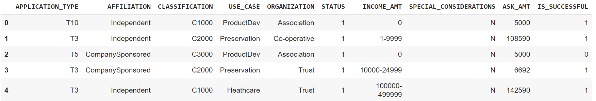
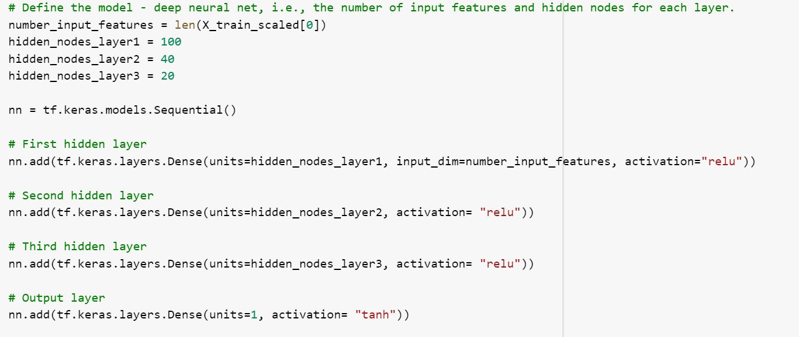

# Neural_Network_Charity_Analysis
## Overview of Project 
### Purpose
The purpose is to know which organizations will receive the donations, analyze the impact of each donation, and vest potential recipients, this helps Beck to ensure that the foundation's money is being used effectively. This analysis is deep complex to use machine learning supervised and unsupervised, so for this analysis we use past experience, statistics, and a deep machine learning model.

## Results 
#### Data Preprocessing

* What variable(s) are considered the target(s) for your model?
The target for this model is "IS SUCCESSFUL", which helps to analyze the past experience.

* What variable(s) are considered to be the features for your model?
The features are "APPLICATION_TYPE", "AFFILIATION", "CLASSIFICATION", "USE_CASE", "ORGANIZATION", "INCOME_AMT",  "SPECIAL_CONSIDERATIONS", "ASK_AMT", "STATUS".

* What variable(s) are neither targets nor features, and should be removed from the input data?
The variables that are neither targets nor features are "EIN", "NAME".

##### Compiling, Training, and Evaluating the Model

* How many neurons, layers, and activation functions did you select for your neural network model, and why?
Neurons for the first layer are 100, a little bit more than 80 was at the beginning and the activation function is "relu".
Because I wanted to optimize the model, adding more neurons but not a lot because it could overfitting and I use "relu" because of the characteristics it has, is the best option.
For the second layer 40 neurons, and the same activation function ("relu"), because also trying to optimize the model I added 10 more neurons than before, not too much because I don't want to overfit the model.
I added another layer, the third one, I used 20 neurons and the same activation function "relu", because I wanted to optimize the model but not making too complex, and previous the overfitting.
For the output layer I changed the activation function because I wanted to observe a different, I used "tanh", unit=1.  

* Were you able to achieve the target model performance?
No, I didn't, actually, my model shows the same accuracy.

* What steps did you take to try and increase model performance?
First, I worked with the column "ASK_AMT" and binning the values, Then I add neurons for the layers, Three, I add an extra layer, then, I change the activation function for the output and finally I increase the number of epochs(100 to 150). 

### Summary

Before the optimizing the model's accuracy was 73%, in this new model the accuracy is also 73%, so to increase the accuracy it will help move neurons, layers, and activation function until we get a better number, so moving a lot of things, are not the answers, it is necessary to try one by one until the result shows better numbers, in other words, a better performance, the epoch is a good number, so try again the output layer with sigmoid seems to be a good idea, and also delete one layer. using the same neurons. Also, binning the column "ASK_AMT" was necessary so for a new model, I will keep the same data frame. 
Working with Neural Network could seem to be more difficult because a little change can impact in a positive or negative way, but the important thing that I can observed is to try different things, and keep the things that are really working.
